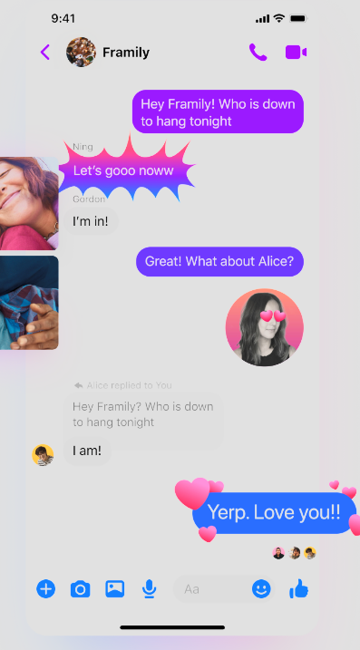

## ZenChat Brainstorm

I've spent a lot of times in messaging apps. I actually can't remember a day where my daily life was not interrupted by a flow of messages from my friends and family. Despite all of the happy moments that group chats have delivered me over the years, I'm still not sure if it's been a net positive on my life.

## The Joy of the Perfect Group Chat

**The Joy of Banter**
Some of the wittiest exchanges I've been a part of have been facilitated through group chat. Group chats offer time to come up with a witty response, and the satisfaction of getting reactions.

**The Convenience of Logistics**
Sometimes you just need to plan a trip, decide what restaurant to go to, and it's more convenient over chat. I'd rather text someone an address than call them.

**The Joy of Sharing Something Creative**
I like to see what people around me are making. I like being connected to creatives.

**The Joy of Shared Documentation**
Whether it's creating a list of top comedy movies or a design document for a software system, there is something that feels so productive and substantial about creating a shared document.

**The Joy of Structured Data**
If a group of friends loves movies, they should be able to comment on a movie (even an old one), make lists of movies. If they love cooking they should be able to make lists of recipes and comment on them. They should be able to tag items with shared attributes, like songs with similar chord progressions, or rooms with similar vibes.

**The Joy of Lists**
Playlists, lists of movies with similar vibes, top ten television shows of all time.

**The Freedom of Not Needing To Read Every Message**
Imagine a world where you know what messages you are expected to read, and what messages are optional. If someone needs a ride, it would be good to broadcast that. If people are just doing banter, it should be easy to ignore both in terms of notifications and social expectations.

**The Freedom of Not Not Needing to Read Every Link**
Link shame is shame of not reading all of the links that are sent tot you.

Reading ever link I'm sent would be a full time job. Managing the reading of lins is difficult. When someone sends a link and it's expected that people read and comment on it, there might be a better format for that then text.

**The Freedom from Superficiality**
From messenger's landing page. Just ... no

**The Right to Focus**

I don't the constant interruptions of group chats. I want to be able to ignore the group chat without any hint of guilt. I also do want to be notified if something actually important is happening.

**The No-Stress Sign Off**

It takes me so long to sign off from a conversation. I wish it was easier to disappear with no feeling that since I started engaging I need to continue.
